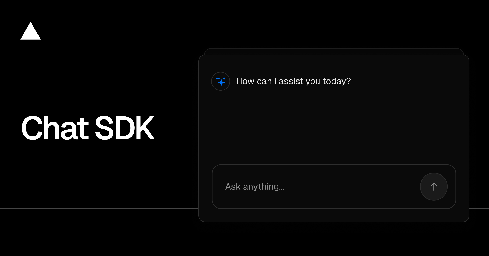

<a href="https://chat.vercel.ai/">
  
  <h1 align="center">Chat SDK</h1>
</a>

<p align="center">
    Chat SDK is a free, open-source template built with Next.js and the AI SDK that helps you quickly build powerful chatbot applications.
</p>

<p align="center">
  <a href="https://chat-sdk.dev"><strong>Read Docs</strong></a> ·
  <a href="#features"><strong>Features</strong></a> ·
  <a href="#finance-tooling"><strong>Finance Tooling</strong></a> ·
  <a href="#model-providers"><strong>Model Providers</strong></a> ·
  <a href="#deploy-your-own"><strong>Deploy Your Own</strong></a> ·
  <a href="#running-locally"><strong>Running locally</strong></a>
</p>
<br/>

## Features

- [Next.js](https://nextjs.org) App Router
  - Advanced routing for seamless navigation and performance
  - React Server Components (RSCs) and Server Actions for server-side rendering and increased performance
- [AI SDK](https://ai-sdk.dev/docs/introduction)
  - Unified API for generating text, structured objects, and tool calls with LLMs
  - Hooks for building dynamic chat and generative user interfaces
  - Supports OpenAI out of the box, with easy swaps for xAI, Fireworks, and other providers
- [shadcn/ui](https://ui.shadcn.com)
  - Styling with [Tailwind CSS](https://tailwindcss.com)
  - Component primitives from [Radix UI](https://radix-ui.com) for accessibility and flexibility
- Data Persistence
  - [Neon Serverless Postgres](https://vercel.com/marketplace/neon) for saving chat history and user data
  - [Vercel Blob](https://vercel.com/storage/blob) for efficient file storage
- [Auth.js](https://authjs.dev)
  - Simple and secure authentication

## Model Providers

This template connects directly to OpenAI via the official AI SDK provider. Define `OPENAI_API_KEY` and the relevant model identifiers (`OPENAI_MODEL_ID`, `OPENAI_REASONING_MODEL_ID`, `OPENAI_TITLE_MODEL_ID`, `OPENAI_ARTIFACT_MODEL_ID`) in your environment to unlock chat, reasoning traces, summarisation, and artefact generation. You can further customise transport behaviour with the optional `OPENAI_BASE_URL`, `OPENAI_ORGANIZATION`, and `OPENAI_PROJECT` environment variables when targeting self-hosted gateways or scoped organisation/project quotas.

With the [AI SDK](https://ai-sdk.dev/docs/introduction), you can also switch to alternative LLM vendors such as [Anthropic](https://anthropic.com), [Cohere](https://cohere.com/), or [xAI](https://x.ai) by swapping the provider initialisation in [`lib/ai/providers.ts`](lib/ai/providers.ts) and adjusting the associated environment variables.

## Deploy Your Own

You can deploy your own version of the Next.js AI Chatbot to Vercel with one click:

[](https://vercel.com/templates/next.js/nextjs-ai-chatbot)

## Running locally

You will need to use the environment variables [defined in `.env.example`](.env.example) to run Next.js AI Chatbot. It's recommended you use [Vercel Environment Variables](https://vercel.com/docs/projects/environment-variables) for this, but a `.env` file is all that is necessary.

### Variables d'environnement essentielles

Configurez explicitement les variables suivantes avant de démarrer le serveur ou d'exécuter la suite de tests. Elles garantissent que les fonctionnalités finance restent hermétiques et que Playwright contourne correctement le rate-limit.

| Variable | Obligatoire | Description |
|----------|-------------|-------------|
| `FEATURE_FINANCE` | Oui | Active les artefacts finance (chart, backtest, news) côté API et UI. Valeur recommandée : `true`. |
| `PLAYWRIGHT` | Pour les tests e2e | Positionnez `true` lors des exécutions Playwright afin de bypasser le rate-limit et d'utiliser les mocks offline. |
| `POSTGRES_URL` | Oui | Chaîne de connexion utilisée par `pnpm db:migrate` et `pnpm db:seed`. |
| `AUTH_SECRET` | Oui | Secret partagé par Auth.js pour signer les sessions regular. |
| `OPENAI_API_KEY` | Oui | Clé API utilisée par l'assistant lors du streaming des réponses. |
| `OPENAI_MODEL_ID` | Oui | Identifiant du modèle de base texte. Voir également `OPENAI_REASONING_MODEL_ID`, `OPENAI_TITLE_MODEL_ID`, `OPENAI_ARTIFACT_MODEL_ID` pour les capacités supplémentaires. |

Ajoutez `FEATURE_USE_REAL_DATA`, `MARKET_DATA_API_BASE_URL`, `MARKET_DATA_API_KEY` et `NEWS_API_KEY` uniquement si vous souhaitez substituer les jeux de données offline par un fournisseur tiers.

> Note: You should not commit your `.env` file or it will expose secrets that will allow others to control access to your various AI and authentication provider accounts.

1. Install Vercel CLI: `npm i -g vercel`
2. Link local instance with Vercel and GitHub accounts (creates `.vercel` directory): `vercel link`
3. Download your environment variables: `vercel env pull`

```bash
pnpm install
pnpm dev
```

Your app template should now be running on [localhost:3000](http://localhost:3000).

## Tests & e2e reliability

- The finance feature set is gated behind the `FEATURE_FINANCE` flag. Enable it
  locally by adding `FEATURE_FINANCE=true` to your `.env.local` before running
  the dev server or any tests.
- The Playwright suites run fully offline. Network requests to `/api/finance/*`
  are intercepted with deterministic fixtures and the browser clock is frozen
  to `2025-03-01T12:00:00Z`. Set `PLAYWRIGHT=true` when invoking scripts so the
  rate limiter expands accordingly.
- Unit tests run with Vitest via `pnpm test`. End-to-end coverage lives under
  `tests/e2e` and can be executed with `pnpm exec playwright test`.

### Résolution des tests e2e

1. Installez les binaires Playwright via `pnpm exec playwright install`.
2. Démarrez le serveur en forçant les flags : `FEATURE_FINANCE=true pnpm dev`.
3. Exécutez les tests dans un second terminal avec `PLAYWRIGHT=true FEATURE_FINANCE=true pnpm exec playwright test`.
4. **Overlay Next “Application error” ?** Vérifiez que le segment `(chat)` monte l'error boundary [`app/(chat)/error.tsx`](app/(chat)/error.tsx) et qu'aucune exception n'est loggée côté console.
5. **Timeout lors de la connexion ?** Confirmez que `tests/setup/auth.setup.ts` a bien persisté l'état de session regular dans `tests/.auth`. Supprimez le répertoire puis relancez la commande précédente pour régénérer le storage state.
6. **Artefacts finance vides ?** Assurez-vous que chaque route `/api/finance/*` est interceptée par `tests/helpers/finance-mocks.ts` et que `PLAYWRIGHT=true` est exporté (sinon le rate-limit bloque les requêtes).
7. Les traces Playwright sont stockées sous `artifacts/` en cas d'échec ; inspectez-les via `pnpm exec playwright show-trace <trace.zip>`.

## Avertissements / Usage responsable

Les fonctionnalités finance intégrées à Chat SDK sont fournies à titre éducatif uniquement. Elles reposent sur des données **mockées hors ligne** conçues pour garantir la reproductibilité des tests et des exemples.

- **Ce n’est pas un conseil financier** : aucune sortie ne doit être interprétée comme une recommandation d’investissement, d’achat ou de vente.
- **Vérifiez toujours auprès de sources officielles** avant de prendre une décision ; les données simulées peuvent être incomplètes, obsolètes ou ne pas refléter les conditions de marché réelles.
- **Comprenez les risques** associés au trading et à l’investissement (perte en capital, volatilité, liquidité). Adaptez les paramètres de stratégie à votre tolérance au risque et n’engagez que des fonds que vous pouvez vous permettre de perdre.
- **Respectez le cadre réglementaire** applicable dans votre juridiction, notamment en matière de conseil personnalisé et d’utilisation de données financières.

Le mode hors ligne est activé par défaut. Pour connecter un fournisseur réel, suivez la procédure décrite dans la section [Finance Tooling](#finance-tooling) tout en conservant l’obligation d’afficher un avertissement clair aux utilisateurs finaux.

## Finance Tooling

The project ships with an offline-friendly finance assistant that can stream interactive artefacts for charts, backtests, fundamentals, and news. Key points:

- **Enable the feature** by setting `FEATURE_FINANCE=true` in your environment. The assistant also requires `OPENAI_API_KEY` and a valid `OPENAI_MODEL_ID` (see `.env.example`).
- **No live market calls** occur during development or CI. Mock datasets under `lib/finance/mock-data.ts` and deterministic seeds populate the catalogue. When you want to plug in a real provider, set `FEATURE_USE_REAL_DATA=true` alongside `MARKET_DATA_API_BASE_URL` and `MARKET_DATA_API_KEY`; the server automatically falls back to mocks if either value is missing.
- **Artefact renderers** live in `components/finance/*` and consume the JSON payloads documented in [`docs/finance/artifacts.md`](docs/finance/artifacts.md).
- **API endpoints** exposed under `/api/finance/*` are validated with Zod, rate-limited, and described in [`docs/finance/api.md`](docs/finance/api.md).
- **Backtesting assumptions** (slippage, commission, metrics) are explained in [`docs/finance/backtest.md`](docs/finance/backtest.md).
- **Risk disclaimer**: the assistant provides educational analysis only—it does **not** constitute personalised financial advice. Always verify outputs against authoritative sources before taking action.

### Finance slash commands

To speed up exploration, the chat input recognises a couple of finance-specific shortcuts:

- `/chart BTCUSD 1D` rewrites into an explicit request for a `finance.chart` artefact covering the BTCUSD pair on daily candles. Append any indicator hints (for example `SMA(50/200)`) after the timeframe to have them echoed in the assistant instructions.
- `/backtest AAPL 2018-01-01 2020-12-31 50 200` expands to a request for an SMA crossover backtest between the supplied dates. If you omit the moving-average windows the helper falls back to the default 50/200 configuration.

Each shortcut still runs through the offline datasets and carries the same non-advisory language enforced across the finance toolkit.

## Production & Vercel configuration

Deployments on Vercel (or any long-lived environment) must provide the same hermetic guarantees as local development. Before pushing a new build, double-check the following configuration:

- **Environment variables**: define `AUTH_SECRET`, `OPENAI_API_KEY`, `OPENAI_MODEL_ID`, `POSTGRES_URL`, and `BLOB_READ_WRITE_TOKEN`. Override `OPENAI_REASONING_MODEL_ID`, `OPENAI_TITLE_MODEL_ID`, and `OPENAI_ARTIFACT_MODEL_ID` if you want to target specialised models per capability. Provide `OPENAI_BASE_URL`, `OPENAI_ORGANIZATION`, and `OPENAI_PROJECT` if you route traffic through a proxy or scoped workspace. The finance artefacts also rely on optional mocks that can source external providers if you later enable them—set `MARKET_DATA_API_KEY`, `MARKET_DATA_API_BASE_URL`, and `NEWS_API_KEY` if you connect to live feeds. Flip `FEATURE_USE_REAL_DATA=true` to activate the HTTP adapter.
- **Feature flags**: keep `FEATURE_FINANCE=true` to enable charting, fundamentals, and backtesting endpoints alongside the system prompt updates documented above.
- **Database readiness**: the build pipeline (and the provided GitHub Actions workflow) runs `pnpm db:migrate` followed by `pnpm db:seed` before executing `pnpm build`. Reproduce that order locally when preparing environment snapshots.
- **Health check**: expose a lightweight probe by hitting [`/api/finance/quote?symbol=BTCUSD`](app/api/finance/quote/route.ts). The endpoint serves deterministic offline data when external APIs are unavailable, making it safe for uptime monitors.

These steps ensure every deployment respects the offline-friendly finance mocks and migration ordering required by the CI pipeline.
